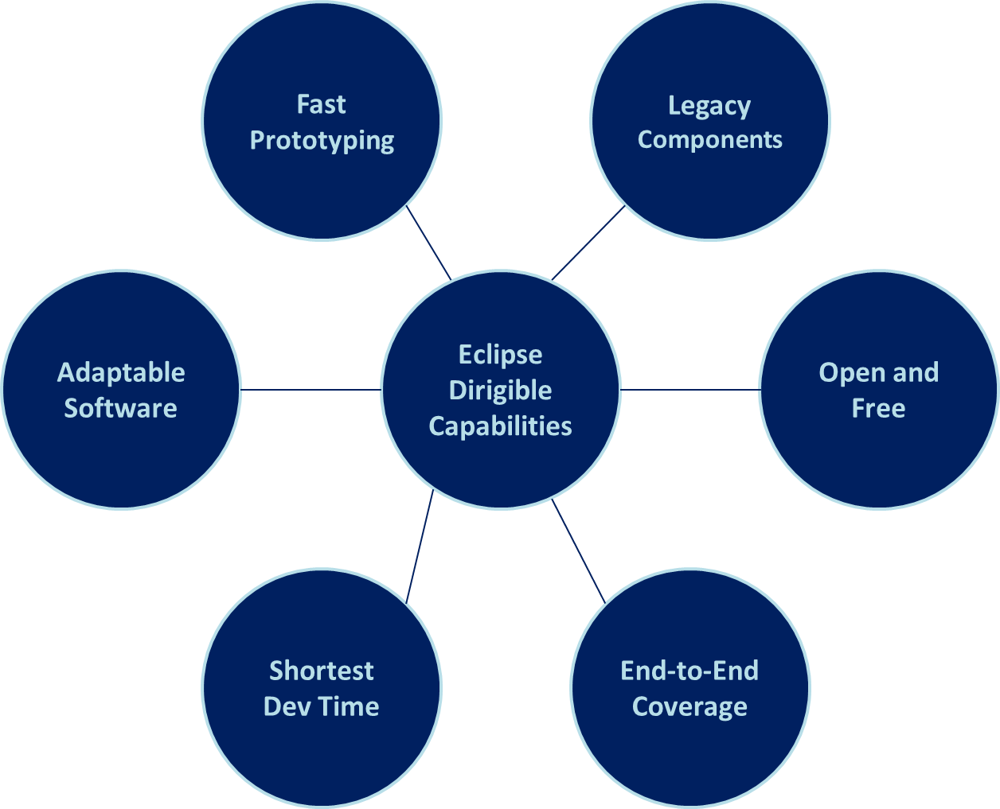

###### Contents
- [What is Eclipse Dirigible?](#what-is-eclipse-dirigible)
- [Prerequisites](#prerequisites)
- [Using Eclipse Dirigible](#using-eclipse-dirigible)
  - [Create a Project](#create-a-project)
  - [Create a Data Structures](#create-a-data-structure)
  - [Create a Scripting Service](#create-a-scripting-service)
  - [Create a User Interface](#create-a-user-interface)
  - [Create a Documentation](#create-a-documentation)

# What is Eclipse Dirigible?
Eclipse Dirigible™ is a Cloud Development Platform providing development tools and runtime environment. It supports full development life-cycle of on-demand applications by leveraging in-system programming models and rapid application development techniques.  

Eclipse Dirigible provides capabilities for end-to-end development process from database modeling and management, through RESTful services authoring using various dynamic languages, to pattern-based user interface generation, role based security, external services integration, testing, debugging, operations, and monitoring.

# Prerequisites

The environment itself runs directly in a browser, therefore does not require additional downloads and installations. It packs all the needed containers, which makes it a self-contained and well-integrated software bundle that can be deployed on any Java based Web server, such as Tomcat, Jetty, JBoss, etc.

In order to get started with Eclipse Dirigible and try out all its functionality you only have to __login with a username in the [Dirigible Web IDE](http://dirigible.eclipse.org/)__.

# Using Eclipse Dirigible

Аfter opening the Dirigible Web IDE, follow the steps to:

### Create a Project
1. Make sure you have the __'Workspace' tab__ opening
2. Click on the __+ icon__ and choose the __Project__ option
3. In the __Name field__ type in a name for your project
4. Click on the __Create Project__ button

### Create a Data Structure
The term Data Structures refers to the domain model of an application. The actual entities in a domain model directly correspond to the underlying database entities, that is, tables and views.

Steps:
  1. If you haven't yet, __create a project__
  2. __Right-click on the name__ of your project
  3. Choose __New -> Data Structure__ from the menu
  4. From the opened dialog, select the __type of the template__ you   want to use and choose __Next__
  5. Next, you'll add all necessary datastructure properties - click   __Add__ to do this
  6. In the dialog, __fill out the fields__ describing your property -   they might differ depending on the template. Click __OK__
  7. After adding all properties, __name your datastructure__   accordingly
  8. Click on __Finish__

### Create a Scripting Service
The following steps will generate
  - a metadata descriptor for the Entity Service
  - service endpoint implementation script
  - Swagger-compliant service definition
  - Scripting Service implementation reusable model  

in the __Scripting Services__ subfolder in your project's root folder

Steps:
  1. If you haven't yet, __create a project__
  2. __Right-click on the name__ of your project
  3. Choose __New -> Scripting Service__ from the menu
  4. From the opened dialog, select the __type of the template__ you   want to use and choose __Next__
  5. Depending on the template, you might be asked to do a couple of   more things - for example, if you choose the __JavaScript Entity   Service on Table__, you'll be asked to select the corresponding table
  6. __Name your servise__ accordingly
  7. Click on __Finish__

### Create a User Interface
The following steps will show you how to manage the User Interface of your project.

Steps:
  1. If you haven't yet, __create a project__
  2. If you haven't yet, __create the scripting service__ you need
  3. Open the __Scripting Services__ subfolder in your project's root folder
  4. Expand the subfolder with your project's name and __right-click your entity__
  5. To generate the UI of your Entity Service, click on __Generate -> User Interface for Entity Service__
  6. From the opened dialog, select the __type of the template__ you   want to use and choose __Next__
  7. __Choose the fields__ which will be necessary and select __Next__
  8. __Name your user interface__ accordingly and select __Next__
  9. Set the page title and click on __Finish__

### Create a Documentation
The following steps will show you how to create a Wiki page for your Eclipse Dirigible project.

Steps:
  1. If you haven't yet, __create a project__
  3. Right-click on the __WikiContent__ subfolder in your project's root folder
  4. From the newly opened menu choose __New -> Wiki Page__
  6. From the opened dialog, select the __type of the template__ you   want to use and choose __Next__
  8. __Name your documentation file__ accordingly and select __Next__
  9. Set the page title and click on __Finish__
  10. You can now __edit the template, add information__ to it, and monitor the changes in the Preview tab
